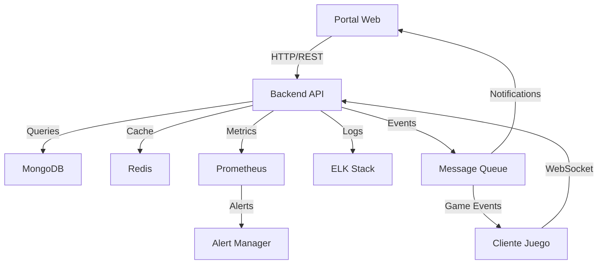

# ARQUITECTURA DEL SISTEMA

## SEPARACIÓN DE RESPONSABILIDADES

### 1. PÁGINA WEB (Portal Web)
**Responsabilidades:**
- Gestión de cuenta
- Monetización
- Información del juego

#### Funcionalidades Web:
1. **Sistema de Cuentas**
   - Login/Registro
   - Verificación de email
   - Recuperación de contraseña
   - Gestión de perfil

2. **Tienda Web**
   - Compra de paquetes
   - Compra de monedas (VAL)
   - Historial de transacciones
   - Estado de pagos

3. **Panel de Usuario**
   - Visualización de monedas
   - Estado de personajes
   - Inventario general
   - Historial de compras

4. **Integración Web3**
   - Conexión de wallet
   - Compras con crypto
   - Visualización de NFTs

#### Stack Tecnológico Web:
```typescript
// Estructura de carpetas para el frontend web
web/
  ├── src/
  │   ├── pages/
  │   │   ├── auth/           // Login, registro, recuperación
  │   │   ├── store/          // Tienda y paquetes
  │   │   ├── profile/        // Perfil de usuario
  │   │   └── wallet/         // Integración crypto
  │   ├── components/
  │   │   ├── shared/         // Componentes comunes
  │   │   ├── store/          // Componentes de tienda
  │   │   └── web3/          // Componentes blockchain
  │   └── services/
  │       ├── auth.service.ts // Servicios de autenticación
  │       ├── store.service.ts // Servicios de tienda
  │       └── web3.service.ts // Servicios blockchain
```

### 2. CLIENTE DEL JUEGO (Unity)
**Responsabilidades:**
- Gameplay core
- Interacción en tiempo real
- Visualización del mundo

#### Funcionalidades del Juego:
1. **Sistema de Combate**
   - Batallas
   - Habilidades
   - Efectos visuales

2. **Sistema de Personajes**
   - Evolución
   - Equipamiento
   - Stats y progresión

3. **Marketplace In-Game**
   - Comercio entre jugadores
   - Subastas
   - Inventario detallado

4. **Sistemas Sociales**
   - Chat en tiempo real
   - Gremios
   - PvP

#### Stack Tecnológico Juego:
```typescript
// Estructura de carpetas para el cliente Unity
game/
  ├── Assets/
  │   ├── Scripts/
  │   │   ├── Combat/         // Sistema de combate
  │   │   ├── Character/      // Gestión de personajes
  │   │   ├── Inventory/      // Sistema de inventario
  │   │   └── Network/        // Comunicación con backend
  │   └── Prefabs/
  │       ├── UI/             // Interfaces del juego
  │       ├── Characters/     // Modelos de personajes
  │       └── Effects/        // Efectos visuales
```

### 3. BACKEND (Servidor Compartido)
**Responsabilidades:**
- API REST para web
- WebSockets para juego
- Base de datos

#### APIs Separadas:
1. **APIs Web** (Prefijo `/web/api/`)
```typescript
// Rutas Web
router.post('/web/api/auth/login');
router.post('/web/api/auth/register');
router.post('/web/api/store/purchase');
router.get('/web/api/profile/wallet');
```

2. **APIs Juego** (Prefijo `/game/api/`)
```typescript
// Rutas Juego
router.post('/game/api/characters/evolve');
router.post('/game/api/combat/attack');
router.post('/game/api/marketplace/list');
router.post('/game/api/social/chat');
```

#### Estructura del Backend:
```typescript
backend/
  ├── src/
  │   ├── web/              // Lógica exclusiva web
  │   │   ├── controllers/
  │   │   ├── routes/
  │   │   └── services/
  │   ├── game/             // Lógica exclusiva juego
  │   │   ├── controllers/
  │   │   ├── routes/
  │   │   └── services/
  │   └── shared/           // Lógica compartida
  │       ├── models/
  │       ├── utils/
  │       └── config/
```

### 4. COMUNICACIÓN ENTRE SISTEMAS

#### Web -> Backend:
- Peticiones HTTP/REST
- Autenticación con JWT
- Respuestas en JSON
- Webhooks para pagos

#### Juego -> Backend:
- WebSockets para tiempo real
- Protocolo binario optimizado
- Estado de sesión persistente
- Eventos y notificaciones

#### Sincronización:
- Cache compartida (Redis)
- Sistema de eventos
- Consistencia eventual
- Validación cruzada

### 5. CONSIDERACIONES DE SEGURIDAD

1. **Autenticación:**
   - Web: JWT con refresh tokens
   - Juego: Tokens de sesión especiales
   - 2FA donde sea crítico

2. **Validación:**
   - Web: Formularios y datos de usuario
   - Juego: Anti-cheat y validación de acciones
   - Shared: Sanitización de datos

3. **Rate Limiting:**
   - Web: Por IP y cuenta
   - Juego: Por acción y ventana de tiempo
   - API: Límites específicos por ruta

### 6. MONITOREO Y LOGGING

#### Sistema de Logs
1. **Niveles de Log**
   - DEBUG: Información detallada para desarrollo
   - INFO: Eventos normales del sistema
   - WARN: Advertencias y situaciones anómalas
   - ERROR: Errores que requieren atención
   - CRITICAL: Errores que requieren acción inmediata

2. **Estructura de Logs**
```typescript
interface LogEntry {
  timestamp: Date;
  level: LogLevel;
  context: string;
  message: string;
  metadata: {
    userId?: string;
    requestId?: string;
    route?: string;
    error?: any;
  }
}
```

3. **Rotación y Retención**
   - Rotación diaria de logs
   - Compresión automática
   - Retención por 30 días
   - Backup en almacenamiento frío

#### Sistema de Métricas
1. **Métricas de Sistema**
   - CPU y Memoria
   - Latencia de red
   - Tiempo de respuesta
   - Errores por minuto

2. **Métricas de Negocio**
   - Usuarios activos
   - Transacciones/min
   - Revenue por hora
   - Retención de usuarios

3. **Alertas Configuradas**
   - High CPU/Memory
   - Error rate spikes
   - Latencia anormal
   - Fallos de autenticación

### 7. FLUJO DE DATOS



Esta arquitectura permite:
1. Separación clara de responsabilidades
2. Escalabilidad independiente
3. Mantenimiento más sencillo
4. Seguridad específica por contexto
5. Optimización por uso