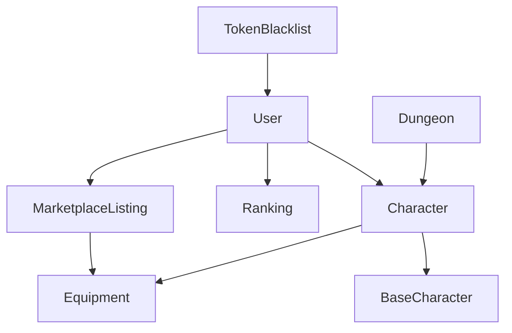

# 📊 MODELOS DE DATOS - Valgame Backend

**Última actualización:** 20 de noviembre de 2025  
**Tiempo de lectura:** 15 minutos

---

## 🎯 VISIÓN GENERAL

Este documento detalla todos los **modelos de datos** del sistema Valgame, incluyendo esquemas MongoDB, validaciones Zod y relaciones entre entidades.

---

## 🗂️ ÍNDICE DE MODELOS

| Modelo | Descripción | Relaciones |
|--------|-------------|------------|
| [User](#user) | Cuenta de usuario | → Character, Ranking, MarketplaceListing |
| [Character](#character) | Personaje jugable | → User, BaseCharacter, Equipment |
| [BaseCharacter](#basecharacter) | Plantilla de personaje | → Character |
| [Equipment](#equipment) | Equipamiento | → Character |
| [Dungeon](#dungeon) | Mazmorra | → Character (combates) |
| [Ranking](#ranking) | Sistema competitivo | → User |
| [MarketplaceListing](#marketplacelisting) | Anuncio marketplace | → User, Item |
| [TokenBlacklist](#tokenblacklist) | Tokens JWT revocados | → User |

---

## 👤 USER

### Descripción
Modelo principal que representa una cuenta de usuario en el sistema.

### Schema MongoDB
```typescript
interface User {
  _id: ObjectId;                    // ID único MongoDB
  email: string;                    // Email único, validado
  username: string;                 // Nombre usuario único, 3-20 chars
  password: string;                 // Hash bcrypt
  val: number;                      // Moneda principal (default: 0)
  evo: number;                      // Moneda evolución (default: 0)
  energia: number;                  // Energía actual (default: 100)
  energiaMaxima: number;            // Energía máxima (default: 100)
  ultimoReinicioEnergia: Date;      // Último reset energía
  createdAt: Date;                  // Fecha creación
  updatedAt: Date;                  // Fecha última modificación
}
```

### Validación Zod
```typescript
export const userSchema = z.object({
  email: z.string()
    .email('Email inválido')
    .max(100, 'Email demasiado largo'),

  username: z.string()
    .min(3, 'Mínimo 3 caracteres')
    .max(20, 'Máximo 20 caracteres')
    .regex(/^[a-zA-Z0-9_-]+$/, 'Solo letras, números, _ y -'),

  password: z.string()
    .min(8, 'Mínimo 8 caracteres')
    .max(100, 'Máximo 100 caracteres')
    .regex(/^(?=.*[a-z])(?=.*[A-Z])(?=.*\d)/,
           'Debe contener mayúscula, minúscula y número'),

  val: z.number()
    .min(0, 'VAL no puede ser negativo')
    .default(0),

  evo: z.number()
    .min(0, 'EVO no puede ser negativo')
    .default(0),

  energia: z.number()
    .min(0, 'Energía no puede ser negativa')
    .default(100),

  energiaMaxima: z.number()
    .min(10, 'Mínimo 10 energía máxima')
    .max(200, 'Máximo 200 energía máxima')
    .default(100)
});
```

### Índices MongoDB
```javascript
// Índice único compuesto para login
db.users.createIndex({ email: 1 }, { unique: true });
db.users.createIndex({ username: 1 }, { unique: true });

// Índice para búsquedas por fecha
db.users.createIndex({ createdAt: -1 });

// Índice para queries de energía
db.users.createIndex({ energia: 1, ultimoReinicioEnergia: 1 });
```

### Relaciones
- **1:N** → Character (un usuario puede tener múltiples personajes)
- **1:1** → Ranking (un usuario tiene un ranking)
- **1:N** → MarketplaceListing (un usuario puede crear múltiples anuncios)

---

## ⚔️ CHARACTER

### Descripción
Representa un personaje jugable que pertenece a un usuario.

### Schema MongoDB
```typescript
interface Character {
  _id: ObjectId;                    // ID único
  userId: ObjectId;                 // Referencia a User
  baseCharacterId: ObjectId;        // Referencia a BaseCharacter
  nivel: number;                    // Nivel actual (1-100)
  experiencia: number;              // XP acumulada
  hp_actual: number;                // Vida actual
  hp_maximo: number;                // Vida máxima
  ataque_base: number;              // Ataque base
  defensa_base: number;             // Defensa base
  estado: 'saludable' | 'herido';   // Estado físico
  etapa_evolucion: number;           // Etapa evolución (1-3)
  puede_evolucionar: boolean;       // Flag evolución disponible
  equipamiento: {                   // Equipamiento actual
    arma?: ObjectId;                // Referencia a Equipment
    armadura?: ObjectId;            // Referencia a Equipment
    accesorio?: ObjectId;           // Referencia a Equipment
  };
  createdAt: Date;                  // Fecha creación
  updatedAt: Date;                  // Fecha modificación
}
```

### Validación Zod
```typescript
export const characterSchema = z.object({
  userId: z.string().refine(isValidObjectId, 'UserId inválido'),

  baseCharacterId: z.string().refine(isValidObjectId, 'BaseCharacterId inválido'),

  nivel: z.number()
    .min(1, 'Nivel mínimo 1')
    .max(100, 'Nivel máximo 100'),

  experiencia: z.number()
    .min(0, 'Experiencia no puede ser negativa'),

  hp_actual: z.number()
    .min(0, 'HP actual no puede ser negativo'),

  hp_maximo: z.number()
    .min(1, 'HP máximo debe ser positivo'),

  ataque_base: z.number()
    .min(1, 'Ataque debe ser positivo'),

  defensa_base: z.number()
    .min(1, 'Defensa debe ser positivo'),

  estado: z.enum(['saludable', 'herido']),

  etapa_evolucion: z.number()
    .min(1, 'Etapa mínima 1')
    .max(3, 'Etapa máxima 3'),

  puede_evolucionar: z.boolean().default(false),

  equipamiento: z.object({
    arma: z.string().refine(isValidObjectId).optional(),
    armadura: z.string().refine(isValidObjectId).optional(),
    accesorio: z.string().refine(isValidObjectId).optional()
  }).default({})
});
```

### Índices MongoDB
```javascript
// Índice para queries por usuario
db.characters.createIndex({ userId: 1 });

// Índice para evolución
db.characters.createIndex({ puede_evolucionar: 1, nivel: -1 });

// Índice compuesto para combate
db.characters.createIndex({ nivel: -1, ataque_base: -1, defensa_base: -1 });
```

### Relaciones
- **N:1** → User (pertenece a un usuario)
- **N:1** → BaseCharacter (basado en plantilla)
- **N:1** → Equipment (puede tener equipamiento)

---

## 🧬 BASECHARACTER

### Descripción
Plantilla base para crear personajes, define estadísticas iniciales.

### Schema MongoDB
```typescript
interface BaseCharacter {
  _id: ObjectId;                    // ID único
  nombre: string;                   // Nombre del personaje
  descripcion: string;              // Descripción detallada
  tipo: 'fuego' | 'agua' | 'tierra' | 'aire' | 'luz' | 'oscuridad';
  rareza: 'comun' | 'raro' | 'epico' | 'legendario';
  estadisticas_base: {              // Stats iniciales
    hp_maximo: number;
    ataque_base: number;
    defensa_base: number;
  };
  costo_invocacion: number;          // VAL para invocar
  imagen_url?: string;              // URL de imagen
  activo: boolean;                  // Disponible para invocar
  createdAt: Date;
  updatedAt: Date;
}
```

### Validación Zod
```typescript
export const baseCharacterSchema = z.object({
  nombre: z.string()
    .min(2, 'Nombre mínimo 2 caracteres')
    .max(50, 'Nombre máximo 50 caracteres'),

  descripcion: z.string()
    .max(500, 'Descripción máxima 500 caracteres'),

  tipo: z.enum(['fuego', 'agua', 'tierra', 'aire', 'luz', 'oscuridad']),

  rareza: z.enum(['comun', 'raro', 'epico', 'legendario']),

  estadisticas_base: z.object({
    hp_maximo: z.number().min(1),
    ataque_base: z.number().min(1),
    defensa_base: z.number().min(1)
  }),

  costo_invocacion: z.number()
    .min(0, 'Costo no puede ser negativo'),

  imagen_url: z.string().url().optional(),

  activo: z.boolean().default(true)
});
```

### Índices MongoDB
```javascript
// Índice para filtrado por tipo y rareza
db.basecharacters.createIndex({ tipo: 1, rareza: 1 });

// Índice para invocación (solo activos)
db.basecharacters.createIndex({ activo: 1, costo_invocacion: 1 });
```

---

## ⚔️ EQUIPMENT

### Descripción
Equipamiento que pueden usar los personajes para mejorar estadísticas.

### Schema MongoDB
```typescript
interface Equipment {
  _id: ObjectId;                    // ID único
  nombre: string;                   // Nombre del equipo
  tipo: 'arma' | 'armadura' | 'accesorio';
  rareza: 'comun' | 'raro' | 'epico' | 'legendario';
  estadisticas_bonus: {             // Bonus que otorga
    hp_maximo?: number;
    ataque_base?: number;
    defensa_base?: number;
  };
  nivel_requerido: number;          // Nivel mínimo para equipar
  precio_venta?: number;            // VAL para vender
  imagen_url?: string;
  activo: boolean;
  createdAt: Date;
  updatedAt: Date;
}
```

### Validación Zod
```typescript
export const equipmentSchema = z.object({
  nombre: z.string()
    .min(2, 'Nombre mínimo 2 caracteres')
    .max(50, 'Nombre máximo 50 caracteres'),

  tipo: z.enum(['arma', 'armadura', 'accesorio']),

  rareza: z.enum(['comun', 'raro', 'epico', 'legendario']),

  estadisticas_bonus: z.object({
    hp_maximo: z.number().min(0).optional(),
    ataque_base: z.number().min(0).optional(),
    defensa_base: z.number().min(0).optional()
  }).refine(data =>
    data.hp_maximo || data.ataque_base || data.defensa_base,
    'Debe otorgar al menos un bonus'
  ),

  nivel_requerido: z.number()
    .min(1, 'Nivel requerido mínimo 1')
    .max(100, 'Nivel requerido máximo 100'),

  precio_venta: z.number()
    .min(0, 'Precio no puede ser negativo')
    .optional(),

  imagen_url: z.string().url().optional(),

  activo: z.boolean().default(true)
});
```

### Índices MongoDB
```javascript
// Índice para equipamiento por tipo y nivel
db.equipment.createIndex({ tipo: 1, nivel_requerido: 1 });

// Índice para filtrado por rareza
db.equipment.createIndex({ rareza: 1, activo: 1 });
```

---

## 🏰 DUNGEON

### Descripción
Mazmorras donde los personajes pueden combatir para ganar experiencia y loot.

### Schema MongoDB
```typescript
interface Dungeon {
  _id: ObjectId;                    // ID único
  nombre: string;                   // Nombre de la mazmorra
  descripcion: string;              // Descripción detallada
  nivel_requerido: number;          // Nivel mínimo para entrar
  costo_energia: number;            // Energía que consume
  recompensas: {                    // Loot posible
    experiencia_min: number;
    experiencia_max: number;
    val_min: number;
    val_max: number;
    items_posibles: ObjectId[];     // Referencias a Equipment
  };
  dificultad: 'facil' | 'medio' | 'dificil' | 'epico';
  activo: boolean;                  // Disponible para jugar
  createdAt: Date;
  updatedAt: Date;
}
```

### Validación Zod
```typescript
export const dungeonSchema = z.object({
  nombre: z.string()
    .min(3, 'Nombre mínimo 3 caracteres')
    .max(50, 'Nombre máximo 50 caracteres'),

  descripcion: z.string()
    .max(500, 'Descripción máxima 500 caracteres'),

  nivel_requerido: z.number()
    .min(1, 'Nivel requerido mínimo 1')
    .max(100, 'Nivel requerido máximo 100'),

  costo_energia: z.number()
    .min(1, 'Costo energía mínimo 1')
    .max(50, 'Costo energía máximo 50'),

  recompensas: z.object({
    experiencia_min: z.number().min(0),
    experiencia_max: z.number().min(0),
    val_min: z.number().min(0),
    val_max: z.number().min(0),
    items_posibles: z.array(z.string().refine(isValidObjectId))
  }).refine(data =>
    data.experiencia_max >= data.experiencia_min &&
    data.val_max >= data.val_min,
    'Valores máximos deben ser >= mínimos'
  ),

  dificultad: z.enum(['facil', 'medio', 'dificil', 'epico']),

  activo: z.boolean().default(true)
});
```

### Índices MongoDB
```javascript
// Índice para filtrado por nivel y dificultad
db.dungeons.createIndex({ nivel_requerido: 1, dificultad: 1 });

// Índice para mazmorras activas
db.dungeons.createIndex({ activo: 1 });
```

---

## 🏆 RANKING

### Descripción
Sistema de clasificación competitivo entre usuarios.

### Schema MongoDB
```typescript
interface Ranking {
  _id: ObjectId;                    // ID único
  userId: ObjectId;                 // Referencia a User
  puntos: number;                   // Puntos de ranking
  victorias: number;                // Victorias totales
  derrotas: number;                 // Derrotas totales
  boletosUsados: number;            // Boletos de ranking usados
  ultimaPartida: Date;              // Fecha última partida
  periodo: 'global' | 'semanal' | 'mensual';
  createdAt: Date;
  updatedAt: Date;
}
```

### Validación Zod
```typescript
export const rankingSchema = z.object({
  userId: z.string().refine(isValidObjectId, 'UserId inválido'),

  puntos: z.number()
    .min(0, 'Puntos no pueden ser negativos')
    .default(0),

  victorias: z.number()
    .min(0, 'Victorias no pueden ser negativas')
    .default(0),

  derrotas: z.number()
    .min(0, 'Derrotas no pueden ser negativas')
    .default(0),

  boletosUsados: z.number()
    .min(0, 'Boletos usados no pueden ser negativos')
    .default(0),

  periodo: z.enum(['global', 'semanal', 'mensual'])
    .default('global')
});
```

### Índices MongoDB
```javascript
// Índice principal para rankings
db.rankings.createIndex({ periodo: 1, puntos: -1 });

// Índice por usuario
db.rankings.createIndex({ userId: 1, periodo: 1 }, { unique: true });
```

---

## 🏪 MARKETPLACELISTING

### Descripción
Anuncios en el marketplace para vender items entre usuarios.

### Schema MongoDB
```typescript
interface MarketplaceListing {
  _id: ObjectId;                    // ID único
  vendedorId: ObjectId;             // Usuario que vende
  itemId: ObjectId;                 // Item a vender (Equipment)
  precio: number;                   // Precio en VAL
  estado: 'activo' | 'vendido' | 'cancelado';
  fecha_creacion: Date;
  fecha_venta?: Date;               // Fecha cuando se vendió
  compradorId?: ObjectId;           // Usuario que compró
  createdAt: Date;
  updatedAt: Date;
}
```

### Validación Zod
```typescript
export const marketplaceListingSchema = z.object({
  vendedorId: z.string().refine(isValidObjectId, 'VendedorId inválido'),

  itemId: z.string().refine(isValidObjectId, 'ItemId inválido'),

  precio: z.number()
    .min(1, 'Precio mínimo 1 VAL')
    .max(1000000, 'Precio máximo 1,000,000 VAL'),

  estado: z.enum(['activo', 'vendido', 'cancelado'])
    .default('activo'),

  compradorId: z.string().refine(isValidObjectId).optional()
});
```

### Índices MongoDB
```javascript
// Índice para listings activos por precio
db.marketplacelistings.createIndex({ estado: 1, precio: 1 });

// Índice por vendedor
db.marketplacelistings.createIndex({ vendedorId: 1, estado: 1 });
```

---

## 🚫 TOKENBLACKLIST

### Descripción
Lista de tokens JWT revocados para logout seguro.

### Schema MongoDB
```typescript
interface TokenBlacklist {
  _id: ObjectId;                    // ID único
  token: string;                    // JWT token hash
  userId: ObjectId;                 // Usuario del token
  expiresAt: Date;                  // Fecha expiración token
  createdAt: Date;
}
```

### Validación Zod
```typescript
export const tokenBlacklistSchema = z.object({
  token: z.string()
    .min(10, 'Token inválido')
    .max(1000, 'Token demasiado largo'),

  userId: z.string().refine(isValidObjectId, 'UserId inválido'),

  expiresAt: z.date()
    .refine(date => date > new Date(), 'Token ya expirado')
});
```

### Índices MongoDB
```javascript
// Índice para verificación rápida de tokens
db.tokenblacklist.createIndex({ token: 1 }, { unique: true });

// TTL index para expiración automática
db.tokenblacklist.createIndex(
  { expiresAt: 1 },
  { expireAfterSeconds: 0 }
);
```

---

## 🔗 RELACIONES COMPLETAS



### Cardinalidad
- **User → Character:** 1:N (un usuario tiene múltiples personajes)
- **User → Ranking:** 1:1 (un usuario tiene un ranking por período)
- **User → MarketplaceListing:** 1:N (un usuario puede crear múltiples anuncios)
- **Character → BaseCharacter:** N:1 (múltiples personajes comparten plantilla)
- **Character → Equipment:** N:N (personaje puede equipar múltiples items)
- **MarketplaceListing → Equipment:** N:1 (cada anuncio vende un item)
- **Dungeon → Character:** 1:N (mazmorra puede ser jugada por múltiples personajes)

---

## 📊 MÉTRICAS DE BASE DE DATOS

### Tamaño Estimado
- **Users:** ~10,000 documentos (1KB cada uno)
- **Characters:** ~50,000 documentos (2KB cada uno)
- **BaseCharacters:** ~50 documentos (5KB cada uno)
- **Equipment:** ~1,000 documentos (3KB cada uno)
- **Dungeons:** ~20 documentos (10KB cada uno)
- **Rankings:** ~10,000 documentos (1KB cada uno)
- **MarketplaceListings:** ~5,000 documentos (1KB cada uno)

**Total estimado:** ~150MB (sin índices)

### Rendimiento
- **Queries principales:** < 50ms
- **Inserts/Updates:** < 10ms
- **Complex aggregations:** < 200ms
- **Concurrent connections:** 100+

---

## 🔧 UTILIDADES DE VALIDACIÓN

### Helper Functions
```typescript
// Validar ObjectId de MongoDB
export const isValidObjectId = (id: string): boolean => {
  return /^[0-9a-fA-F]{24}$/.test(id);
};

// Validar email único
export const isEmailUnique = async (email: string): Promise<boolean> => {
  const existing = await User.findOne({ email });
  return !existing;
};

// Validar username único
export const isUsernameUnique = async (username: string): Promise<boolean> => {
  const existing = await User.findOne({ username });
  return !existing;
};
```

### Custom Zod Refinements
```typescript
// Refinement para ObjectId válido
const objectIdRefinement = (value: string) =>
  isValidObjectId(value) || 'ID de MongoDB inválido';

// Refinement para unicidad de email
const uniqueEmailRefinement = async (email: string) => {
  const isUnique = await isEmailUnique(email);
  return isUnique || 'Email ya registrado';
};
```

---

## 📚 REFERENCIAS

### Documentación Relacionada
- **[Arquitectura General](../00_INICIO/ARQUITECTURA_GENERAL.md)** - Visión general del sistema
- **[API Reference](../01_BACKEND_CORE/API_REFERENCE_COMPLETA.md)** - Endpoints que usan estos modelos
- **[Base de Datos](../01_BACKEND_CORE/BASE_DATOS.md)** - Configuración MongoDB

### Esquemas JSON
- **[Error Schema](../../schemas/error.schema.json)** - Estructura errores
- **[Response Schema](../../schemas/response.schema.json)** - Estructura respuestas

---

**📊 Modelos:** 8 entidades principales  
**🔗 Relaciones:** Normalizadas y optimizadas  
**✅ Validación:** Type-safe con Zod  
**⚡ Performance:** Índices estratégicos  

---

**📅 Última actualización:** 20 de noviembre de 2025  
**👥 Autor:** Equipo Valgame  
**📖 Estado:** ✅ Documentado y validado</content>
<parameter name="filePath">c:\Users\Haustman\Desktop\valgame-backend\docs_reorganizada\01_BACKEND_CORE\MODELOS_DATOS.md